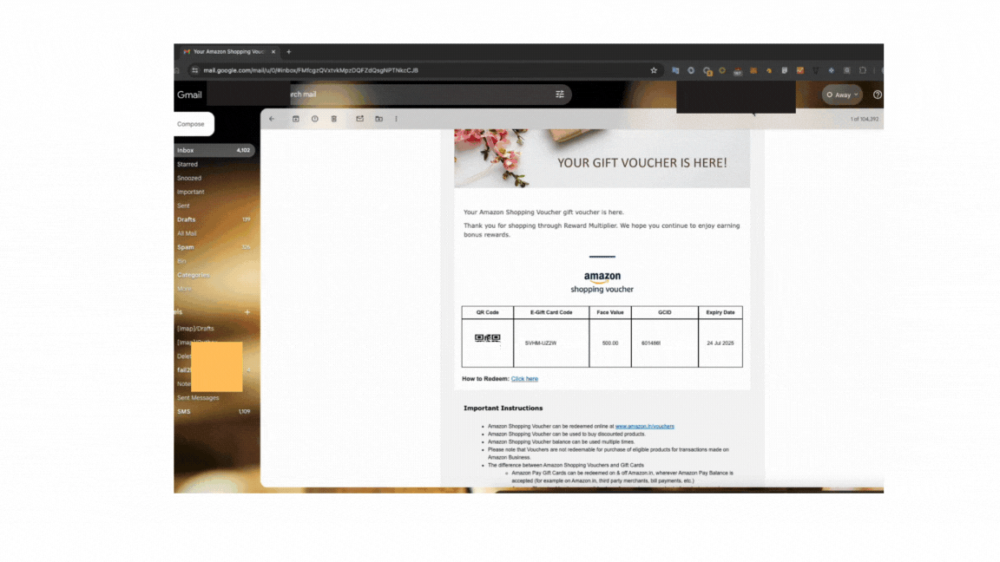

# Amazon Auto Code Redeemer Chrome Extension

## Overview

Amazon Auto Code Redeemer is a Chrome extension designed to streamline the process of extracting Amazon discount codes from Gmail and applying them on Amazon.in. This extension provides a user-friendly interface that adapts based on the current website, offering relevant functionality whether you're in your email or on Amazon.

## Features

- **Context-Aware Button**: The main action button changes its text and functionality based on the current website:
  - On Gmail: "Extract Amazon Codes"
  - On Amazon.in: "Apply Amazon Code"

- **Code Extraction**: Easily extract Amazon discount codes from your Gmail messages.
- **Code Application**: Quickly apply extracted codes on Amazon.in during checkout.
- **Storage Management**: Clear stored codes with a single click.
- **Batch Application**: This extension facilitates the application of multiple discount codes in Amazon.in's checkout page with just a single click. 

## To use this feature, follow these steps:

   1. Open the Gyftr mail content on one tab (make the codes visible).
   2. Click on the extension, this will open a new tab for amazon.
   3. Click on the extension again.
   4. Once the work is done, close the Amazon tab. 

## Installation

1. Clone this repository or download the ZIP file.
2. Open Chrome and navigate to `chrome://extensions/`.
3. Enable "Developer mode" in the top right corner.
4. Click "Load unpacked" and select the directory containing the extension files.

## Usage

## For Amazon Shopping Voucher
1. Click on the extension icon in your Chrome toolbar.
2. The popup will display a ticket-shaped interface with two buttons.
3. Use the main action button to extract or apply codes, depending on your current website.
4. Use the "Clear Storage" button to remove all stored codes.

## For APAY Voucher
0. Add some item in the cart, go till payment page. Come back to Gmail.
1. Click on the extension icon in your Chrome toolbar.
2. The popup will display a ticket-shaped interface with two buttons.
3. Use the main action button to extract or apply codes, depending on your current website.
4. Use the "Clear Storage" button to remove all stored codes.

## Future Work
1. Need to remove the need to go to Cart for APAY vouchers.

## Demo

Check out our demo video to see the Amazon Auto Code Redeemer in action:

## Technical Details

This extension is built using:
- HTML5
- CSS3
- JavaScript
- Chrome Extension APIs

Key files:
- `popup.html`: The main interface of the extension
- `styles.css`: Styling for the ticket-shaped design
- `popup.js`: Handles the logic for button text changes and actions
- `manifest.json`: Extension configuration file

## Contributing

We welcome contributions to improve the Amazon Auto Code Redeemer! Please feel free to submit issues or pull requests.

## License

This project is licensed under the MIT License - see the [LICENSE](LICENSE) file for details.

## Disclaimer

This software is provided "as is", without warranty of any kind, express or implied. The authors and copyright holders of this software shall not be liable for any claim, damages, or other liability arising from the use or misuse of this software. Use at your own risk.

## Acknowledgements

<a href="https://www.flaticon.com/free-icons/trash-can" title="trash can icons">Trash can icons created by Graphics Plazza - Flaticon</a>
